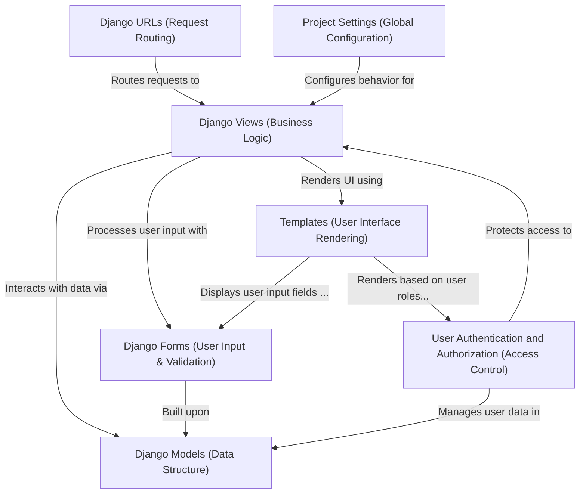

# Online Examination System - Django Project

## Project Overview

This project is an **Online Examination System** built using the Django framework. It provides functionalities for *students* to take online exams, *teachers* to create and manage courses and questions, and an *administrator* to oversee the entire system, including user management, teacher approvals, and content control. The system ensures secure access through robust **user authentication and authorization** and delivers a dynamic user interface through **templates**.


## Visual Overview




## Features

### Student Panel

- Register and log in to the system
- View available courses and exams
- Attend online examinations (MCQ type)
- View obtained marks and number of attempts

### Teacher Panel

- Requires admin approval for account activation
- Manage courses and question sets
- Add, edit, and delete questions with multiple-choice answers
- View total number of students

### Admin Panel

- Full system control
- Approve/decline teacher registration requests
- Set up teacher salaries
- Manage courses and question sets
- View student marks and number of attempts
- Manage teacher and student records

## Technology Stack

- **Backend:** Python (Django Web Framework)
- **Frontend:** HTML, CSS (Bootstrap)
- **Database:** SQLite

## Installation & Setup

### Prerequisites

- Python installed on your local machine
- Django framework

### Steps to Run the Project

1. **Download and Extract**  
   - Unzip the project files and navigate to the root folder.

2. **Create a Virtual Environment** (optional but recommended)

   ```sh
   python -m venv env
   source env/bin/activate  # On macOS/Linux
   env\Scripts\activate  # On Windows
   
3. **Install the requirements**    
    ```sh
    pip install -r requirements.txt

4. **Make Database Migrations**
   ```sh
   python manage.py makemigrations
   python manage.py migrate

5. **Run the Server**
   ```sh
   python manage.py runserver

6. **Access the Application**
     Open your web browser and go to:
     http://127.0.0.1:[PORT_NUMBER]/

7. **Create Admin User (for admin panel access)**
   ```sh
   python manage.py createsuperuser
   ```
   - Follow the prompts to set up an admin username and password.

### Usage Instructions
  - Students: Register, log in, take exams, and check results.
  - Teachers: Manage courses and question sets after admin approval.
  - Admins: Oversee system operations, manage users, and approve teachers.

### Contributing
  If you’d like to contribute to this project, feel free to fork the repository and submit pull requests.

### License
  This project is open-source and free to use.

- Developer: Naveen M
- Project Type: Web Application
- Language: Python (Django)
- Database: SQLite


   
